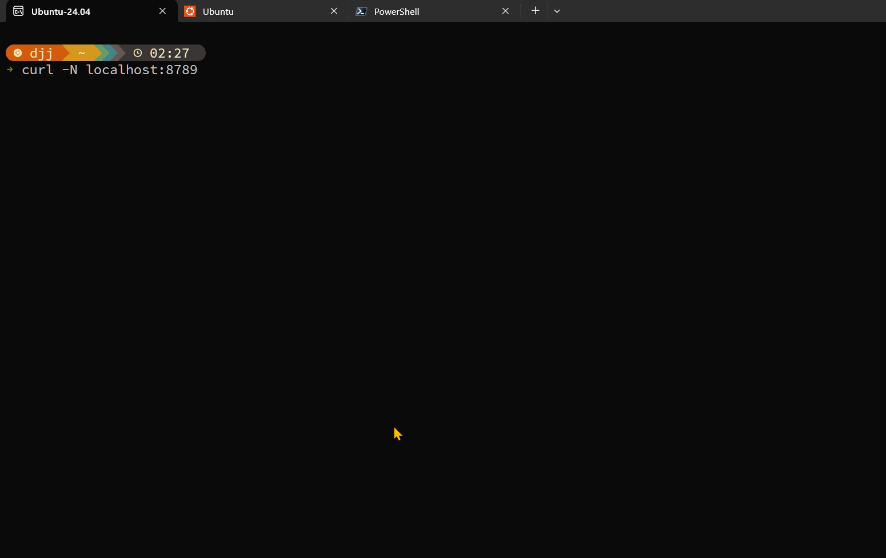

# curl-resume

一个炫酷的终端简历项目，通过 `curl` 命令即可在终端中展示带动画效果的个人简历。

```bash
curl -N me.pdjjq.org
```

## Demo



## 特性

- 流式动画效果（打字机、解密、故障、Matrix 等）
- 多页面系统（Logo、Markdown、图片、原始文本）
- 图片/GIF 转 ASCII 艺术（支持彩色）
- Markdown 终端渲染（带 ANSI 颜色）
- 高度可配置（只需修改 `src/config.ts`）
- TypeScript 编写，类型安全
- 基于 Cloudflare Workers，全球边缘部署

## 快速开始

### 1. 安装依赖

```bash
npm install
```

### 2. 预处理资源

```bash
npm run preprocess
```

这会处理配置中的图片和 Markdown，生成预处理数据。

### 3. 本地开发

```bash
npm run dev
```

然后在另一个终端测试：

```bash
curl -N http://localhost:8789
```

> `-N` 参数禁用缓冲，确保流式动画效果正常显示

### 4. 部署到 Cloudflare

```bash
npm run deploy
```

## 配置说明

所有配置都在 `src/config.ts` 文件中。

### 全局设置

```typescript
export const config: Config = {
  global: {
    speed: {
      typing: 20,        // 打字速度 (ms)
      typingPause: 100,  // 标点停顿 (ms)
      transition: 80,    // 切换动画速度 (ms)
      effect: 50,        // 动效速度 (ms)
    },
    theme: {
      primary: "brightCyan",
      secondary: "green",
      accent: "yellow",
    },
  },
  pages: [/* ... */],
};
```

### 页面类型

#### Logo 页面

生成 ASCII 大字 Logo，带光波扫描效果。

```typescript
{
  type: "logo",
  content: {
    text: "DJJ",                    // 转换为 ASCII 大字
    subtitle: "Your Subtitle",
    tagline: "Your Tagline",
  },
  transition: "fade",
}
```

#### Markdown 页面

支持完整的 Markdown 渲染，带终端颜色。

```typescript
{
  type: "markdown",
  content: {
    markdown: `
## About Me

> Your quote here

**Bold text** and *italic text*.

- List item 1
- List item 2
`,
  },
  effect: "typing",      // 打字机效果
  transition: "fade",
}
```

#### Image 页面

支持静态图片和 GIF 动画转 ASCII。

```typescript
// 静态图片
{
  type: "image",
  content: {
    src: "assets/photo.png",   // 本地或 URL
    width: 80,                 // ASCII 宽度
    colored: true,             // 是否彩色
  },
  effect: "none",
}

// GIF 动画
{
  type: "image",
  content: {
    src: "assets/animation.gif",
    width: 50,
    colored: true,
    animated: true,            // 启用动画
  },
}
```

#### Raw 页面

原始文本，适合 slogan 等。

```typescript
{
  type: "raw",
  content: {
    text: "Your slogan here!",
  },
  effect: "decrypt",     // 解密效果
}
```

### 页面选项

每个页面支持以下选项：

| 选项 | 类型 | 说明 |
|------|------|------|
| `effect` | string | 内容动效：`none` / `typing` / `decrypt` / `glitch` / `matrix` |
| `transition` | string | 过渡动画：`none` / `fade` / `glitch` / `scanline` |
| `stayTime` | number | 页面停留时间 (ms) |
| `speedMultiplier` | number | 动画速度倍率（1=正常，<1加快，>1减慢） |

### 动画效果

- **none** - 直接显示
- **typing** - 打字机逐字输出
- **decrypt** - 黑客解密风格
- **glitch** - 故障抖动
- **matrix** - 黑客帝国下落效果

### 过渡动画

- **none** - 无过渡
- **fade** - 清屏渐隐
- **glitch** - 故障切换
- **scanline** - 扫描线

## 项目结构

```
├── src/
│   ├── index.ts              # Worker 入口
│   ├── config.ts             # 用户配置文件 (修改这里!)
│   ├── types.ts              # TypeScript 类型定义
│   ├── streamHandler.ts      # 流式输出主入口
│   ├── pageRenderer.ts       # 页面渲染器
│   ├── effects.ts            # 动画效果库
│   ├── asciiGenerator.ts     # ASCII 艺术字生成器
│   ├── imageToAscii.ts       # 图片转 ASCII (运行时 fallback)
│   ├── markdownRenderer.ts   # Markdown 渲染 (运行时 fallback)
│   ├── utils.ts              # 工具函数和 ANSI 码
│   └── preprocessed-data.ts  # 预处理数据 (自动生成)
├── scripts/
│   └── preprocess.ts         # 构建时预处理脚本
├── assets/                   # 图片资源目录
├── wrangler.toml             # Cloudflare Workers 配置
└── package.json
```

## 构建流程

```
npm run preprocess
       ↓
┌──────────────────────────────────┐
│  scripts/preprocess.ts           │
│  - 处理 Markdown → ANSI 终端格式  │
│  - 处理图片 → ASCII 艺术          │
│  - 处理 GIF → ASCII 帧序列        │
└──────────────────────────────────┘
       ↓
   src/preprocessed-data.ts
       ↓
npm run deploy → Cloudflare Workers
```

## 自定义域名

### 1. 修改 wrangler.toml

```toml
routes = [{ pattern = "your.domain.com/*", zone_name = "domain.com" }]
```

### 2. 在 Cloudflare Dashboard 配置 DNS

添加 A 记录或 CNAME 记录，并开启 Proxy（小黄云）。

### 3. 部署

```bash
npm run deploy
```

## 技术栈

- **Runtime**: Cloudflare Workers
- **Language**: TypeScript
- **Markdown**: marked + marked-terminal
- **Image Processing**: Jimp (构建时)
- **GIF Decoding**: decode-gif

## 许可证

MIT
